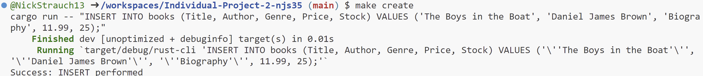
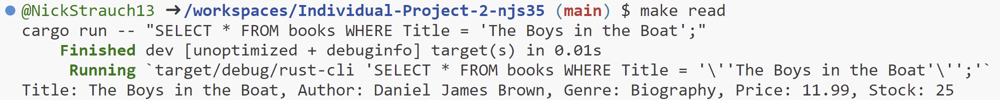
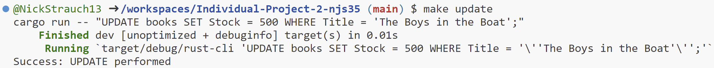
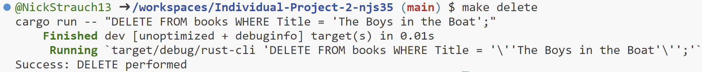

# Rust SQLite CLI with Optimized Binary

## Project Overview
[--> Video Walkthrough <--](https://youtu.be/cSRo3_Vtifg)

This project is centered around building a Rust CLI tool that allows the user to perform CRUD operations on a SQLite database. The CLI tool is straightforward to use, taking a SQL query of any format as an input. 

While developing this project, I utilized GitHub Copilot to expedite the coding process. Copilot did a great job at suggesting error handling techniques in Rust, and I was able to learn a lot about the language by using it. Copilot also helped me to connect to and query the SQLite database using the rusqlite library. Additionally, Copilot helped me to improve the robustness of my tests to ensure that they were verifying the correct behavior of the functions.

This project also effectively handles errors in Rust. The code checks if an appropriate number of command-line arguments is provided. If not, it logs a report and returns early. This ensures that the program doesn't proceed to the querying stage with incomplete or incorrect input. The code also makes use of the Result type when calling the functions execute_read_query and execute_cud_query. In both cases, it uses a match expression to handle the potential results, either success (Ok) or failure (Err). This enforces explicit error handling and helps prevent unwarranted panics.

## CLI Tool Usage and Dependency Installation

The included Cargo.toml file specifies the project metadata and dependencies.

1.  Run `cargo build` command to compile the project's source code and its dependencies.

2.  Run `cargo run -- "<Your SQL query here>"` to execute the CLI tool. The queries will be executed on the bookstore_inventory.db SQLite database.

3.  To run a selection of pre-written CRUD operations, run any of the following: `make create`,  `make read`,  `make update`,  `make delete`. 

4.  To format the Rust code, run `make format`.

5.  To lint the Rust code, run `make lint`.

6.  To run the tests, run `make test`.

7.  To generate a release binary, run `make release`. However, a generated binary is already included in the repository for convenience.

## CRUD Operations Demo

### Create

### Read

### Update

### Delete
